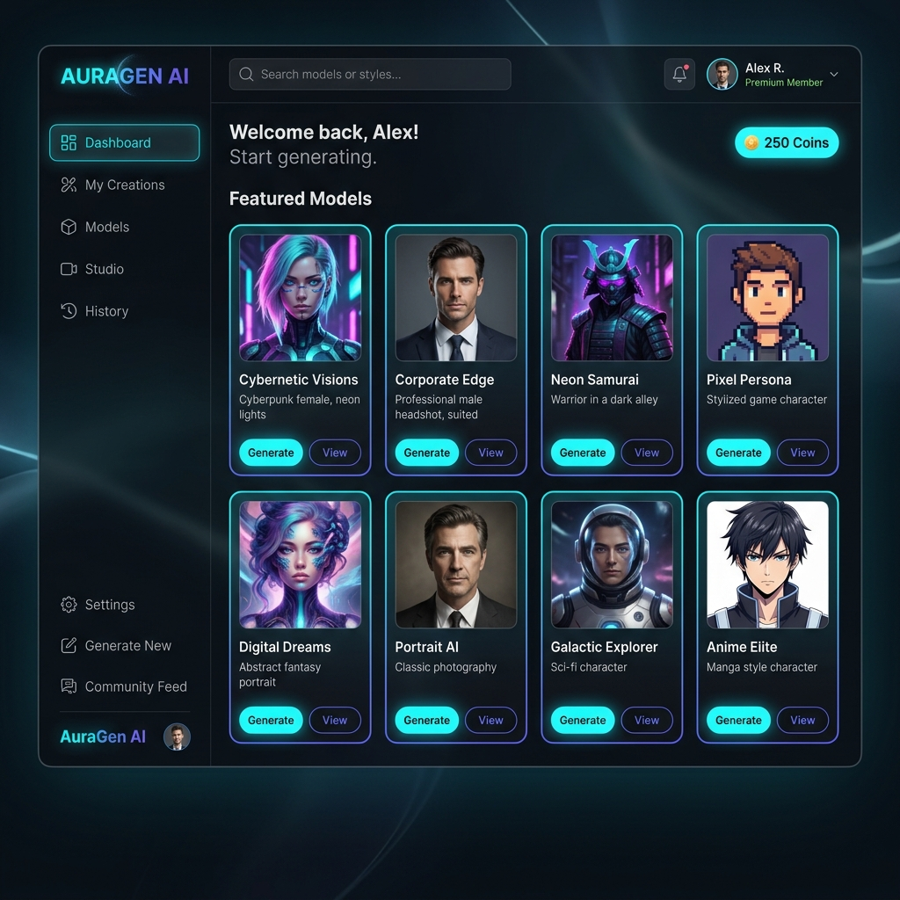
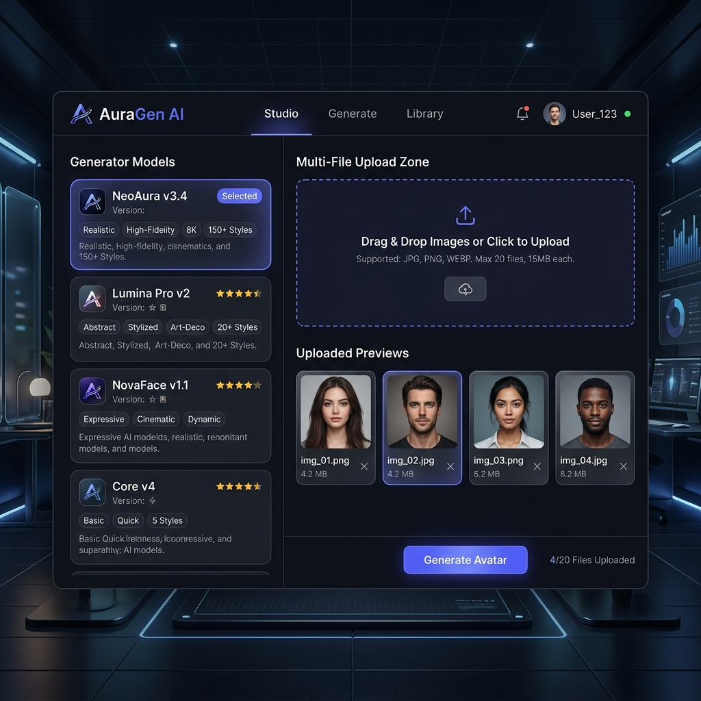

# AuraGen AI - Premium Avatar & Image Generation Studio

A state-of-the-art computational AI Avatar and Image Generation Web Application built with **React 19, TypeScript, Vite, Motion, and Tailwind CSS v4**. Styled with deep space ultra-glassmorphism, vibrant ambient glows, and responsive micro-animations.

---

## 🎨 Visual Interface Previews

| Creative Studio Dashboard | Generation & Synthesis Studio |
| :---: | :---: |
|  |  |

---

## ⚡ Core Capabilities

1. **Django REST API Integration:** centralised token auth (`/api/login/` & `/api/register/`), banners carousel `/api/banners/`, categories `/api/categories/`, and models list `/api/generators/`.
2. **Dynamic Sandbox Fallback:** Automatically falls back to high-fidelity simulated local databases if the backend server is offline, enabling instant isolated testing out-of-the-box.
3. **Real-time WebSockets:** Hooks into `ws_url` progress feeds to parse server-side GPU denoising progress (0-100%) and print active logs inside a dynamic terminal monitor console.
4. **Shetab Cafe Bazaar Checkout:** Integrated with `/api/plans/` and `/api/plans/verify/` to verify Rial checkout receipt validation SKU tokens from Cafe Bazaar Android SDK securely.
5. **Theme Precision:** Premium custom variable designs locked into the default dark **Cyberpunk theme**.

---

## 🐳 Running via Docker

The project contains a production-grade multi-stage Node Alpine `Dockerfile` and a port-mapping script. To spin up the environment, run:

```bash
docker compose up --build -d
```
Then visit **[http://localhost:3000](http://localhost:3000)** in your browser!

---

## 🚀 Running Locally (Development)

**Prerequisites:** Node.js (v20+)

1. Install dependencies:
   ```bash
   npm install
   ```
2. Set your Google Gemini API token inside [.env.example](.env.example) to enable real-time prompt recommendations.
3. Run the development server:
   ```bash
   npm run dev
   ```
   Navigate to `http://localhost:3000` to interact with the studio!

